# Project Eventix

[](https://openjdk.org/)
[](https://spring.io/projects/spring-boot)
[-black.svg)](https://kafka.apache.org/)
[](https://redis.io/)
[](https://www.postgresql.org/)
[](https://react.dev/)
[](https://www.typescriptlang.org/)
[](https://tailwindcss.com/)

**Project Eventix** is an enterprise-grade, high-concurrency, event-driven e-commerce platform engineered with a **Java 21 / Spring Boot 3** multi-project backend and a modern **React 18 / TypeScript / Tailwind CSS** Single Page Application (SPA).

The system implements the **Choreography Saga Pattern**, **Transactional Outbox Pattern** with **Debezium Change Data Capture (CDC)**, **Redisson Distributed Locks** for race-condition-free stock reservations, **Redis Token Bucket Rate Limiting**, and **Spring STOMP WebSockets** for real-time checkout telemetry.

---

## Table of Contents
1. [System Architecture Diagram](#1-system-architecture-diagram)
2. [End-to-End Choreography Saga Flow](#2-end-to-end-choreography-saga-flow)
3. [Saga Compensation & Failure Handling](#3-saga-compensation--failure-handling)
4. [Transactional Outbox & Debezium CDC Pipeline](#4-transactional-outbox--debezium-cdc-pipeline)
5. [Concurrency Defense: Redisson Distributed Locking](#5-concurrency-defense-redisson-distributed-locking)
6. [Edge Rate Limiting (Redis Token Bucket)](#6-edge-rate-limiting-redis-token-bucket)
7. [GDPR & PCI-DSS Data Sanitization Pipeline](#7-gdpr--pci-dss-data-sanitization-pipeline)
8. [Scheduled Daily Digest Flow](#8-scheduled-daily-digest-flow)
9. [Database-Per-Service Topology](#9-database-per-service-topology)
10. [Network & Port Allocation Map](#10-network--port-allocation-map)
11. [Microservices Catalog](#11-microservices-catalog)
12. [Frontend Application (18 Routes)](#12-frontend-application-18-routes)
13. [How to Run the Project](#13-how-to-run-the-project)

---

## 1. System Architecture Diagram

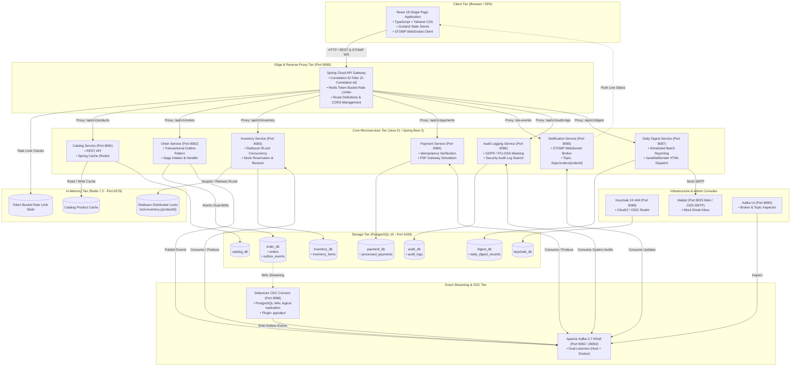

---

## 2. End-to-End Choreography Saga Flow

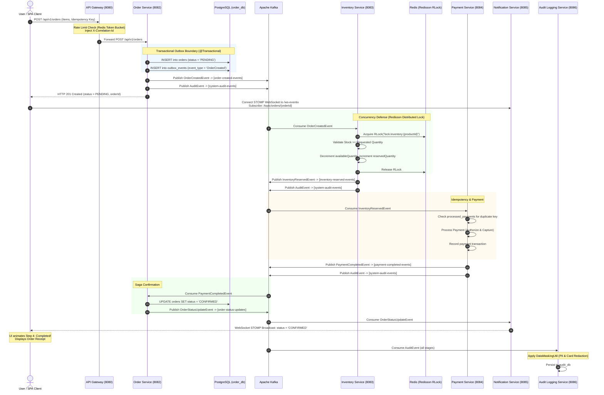

---

## 3. Saga Compensation & Failure Handling

### Scenario A: Insufficient Stock (Inventory Failure)

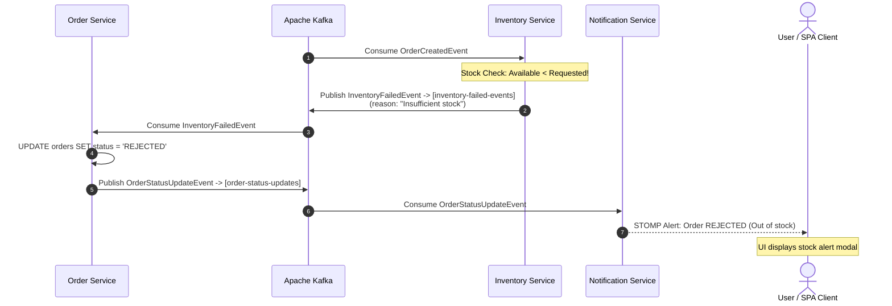

### Scenario B: Payment Declined (Compensating Transaction)

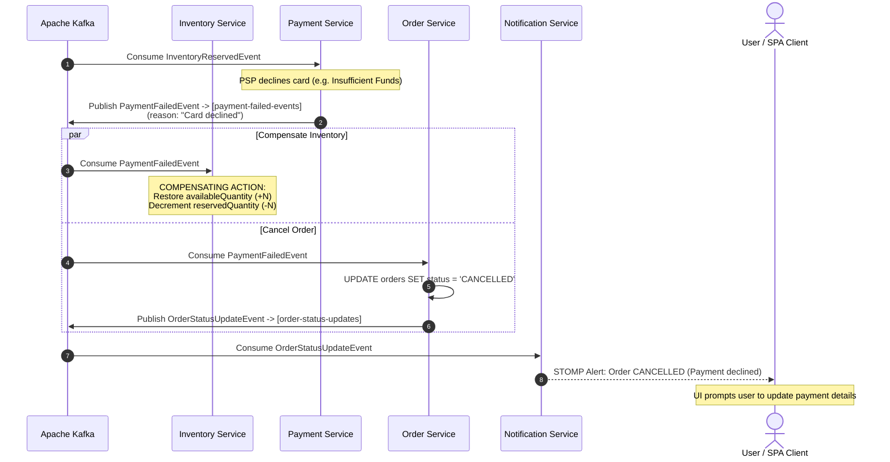

---

## 4. Transactional Outbox & Debezium CDC Pipeline

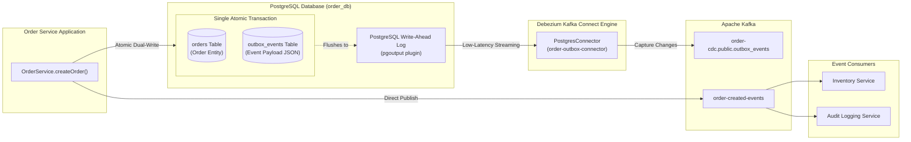

---

## 5. Concurrency Defense: Redisson Distributed Locking

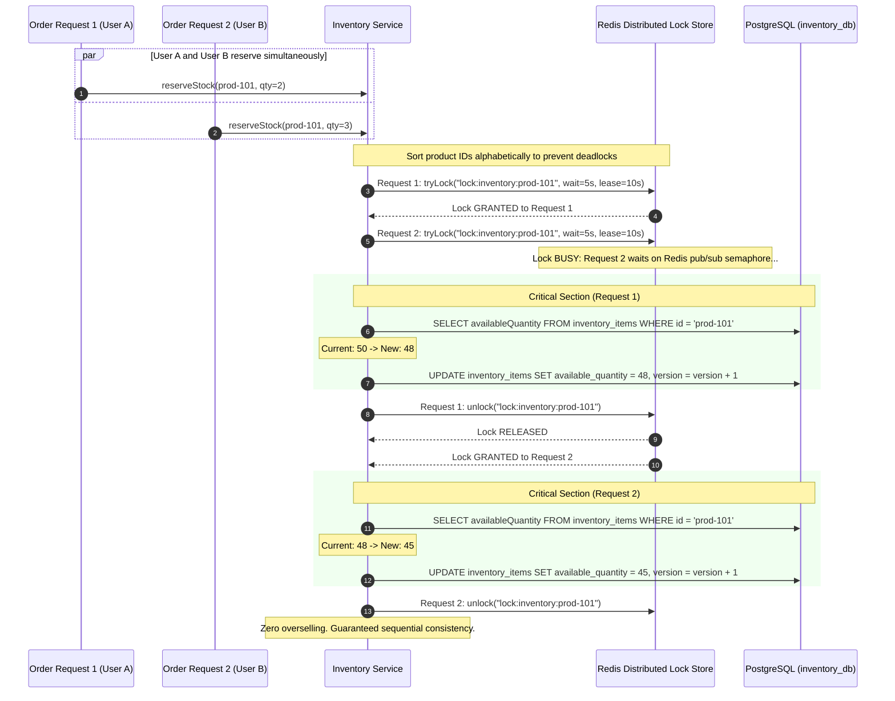

---

## 6. Edge Rate Limiting (Redis Token Bucket)

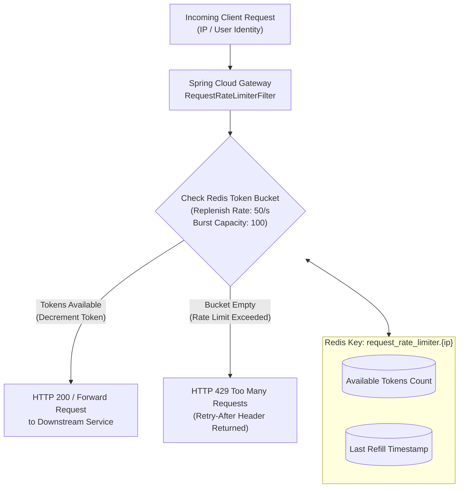

---

## 7. GDPR & PCI-DSS Data Sanitization Pipeline

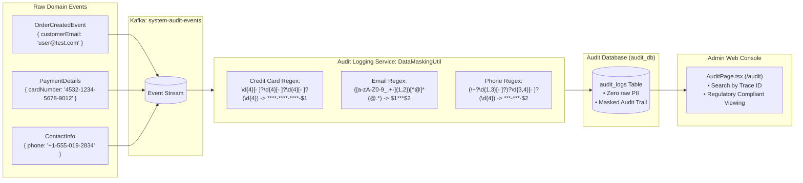

---

## 8. Scheduled Daily Digest Flow

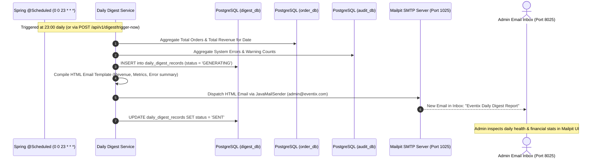

---

## 9. Database-Per-Service Topology

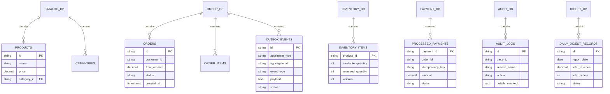

---

## 10. Network & Port Allocation Map

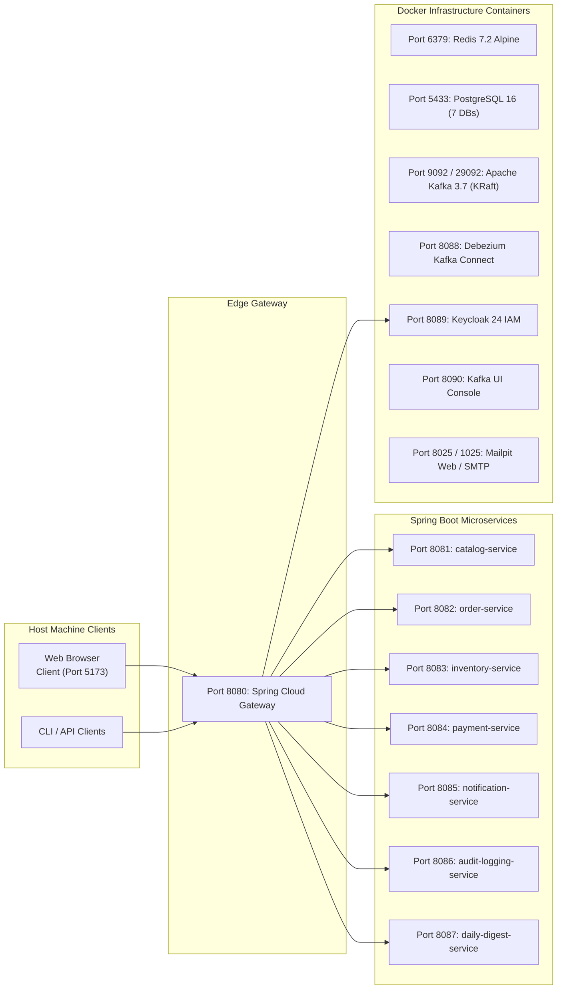

---

## 11. Microservices Catalog

| Service | Port | Database | Primary Technologies & Responsibilities |
| :--- | :--- | :--- | :--- |
| **`api-gateway`** | `8080` | Redis 7 | Spring Cloud Gateway, Redis Token Bucket Rate Limiter, Global `X-Correlation-Id` tracing, CORS management. |
| **`catalog-service`** | `8081` | `catalog_db` | Spring Boot 3, Spring Data JPA, Spring Cache (Redis), product search, categories, automated seeding. |
| **`order-service`** | `8082` | `order_db` | Spring Boot 3, Transactional Outbox dual-write, Saga initiator, compensation listener (`order-failed`). |
| **`inventory-service`** | `8083` | `inventory_db` | Spring Boot 3, Redisson distributed locking, multi-item dead-lock prevention, stock reservation & restock. |
| **`payment-service`** | `8084` | `payment_db` | Spring Boot 3, Idempotency tracking engine, mock payment gateway verification, payment completion events. |
| **`notification-service`** | `8085` | N/A | Spring WebSocket, STOMP broker (`/ws-eventix`), multi-destination topic broadcasting. |
| **`audit-logging-service`**| `8086` | `audit_db` | Spring Kafka, `DataMaskingUtil` GDPR/PCI-DSS sanitization engine, queryable security audit API. |
| **`daily-digest-service`** | `8087` | `digest_db` | Scheduled batch aggregator (`0 0 23 * * *`), `JavaMailSender`, HTML email dispatch to Mailpit. |
| **`common-dto`** | Library | N/A | Shared event records (`OrderCreatedEvent`, `InventoryReservedEvent`, etc.), DTOs, and Kafka topic constants. |

---

## 12. Frontend Application (18 Routes)

1. **`HomePage` (`/`)**: Hero banner, architecture feature highlights, and trending products.
2. **`CatalogPage` (`/products`)**: Product browsing, category filtering, search query, stock status tags, and wishlist integration.
3. **`ProductDetailPage` (`/products/:id`)**: High-res imagery, specifications, quantity selector, add to cart, and instant checkout.
4. **`CartPage` (`/cart`)**: Reactive cart management, tax calculation, promo code entry, and checkout flow trigger.
5. **`CheckoutPage` (`/checkout`)**: Shipping details, mock credit card input, and idempotency key generation.
6. **`OrderStatusPage` (`/orders/:id/status`)**: Live `@stomp/stompjs` WebSocket consumer animating the 4-step Saga progression with automated compensation handling.
7. **`OrderConfirmationPage` (`/orders/:id/confirmation`)**: Formatted invoice receipt with printable layout.
8. **`WishlistPage` (`/wishlist`)**: Saved items grid with single/bulk "Move to Cart" action.
9. **`LoginPage` (`/login`)**: Instant Customer & Admin token generation, redirect-preserving navigation.
10. **`RegisterPage` (`/register`)**: Validation-guarded user registration form.
11. **`ForgotPasswordPage` (`/forgot-password`, `/reset-password`)**: Multi-step password reset workflow.
12. **`OrderHistoryPage` (`/account/orders`)**: Historical orders view with status badges and re-order triggers.
13. **`ProfilePage` (`/account/profile`)**: Account security and personal preference settings.
14. **`SystemHealthPage` (`/system-health`)**: Live telemetry dashboard tracking all 8 services and 6 infrastructure nodes.
15. **`SupportFaqPage` (`/support`, `/faq`)**: Technical architecture FAQ accordion and ticket submission.
16. **`AuditPage` (`/audit`)**: Admin console displaying GDPR/PCI-DSS masked audit logs.
17. **`DigestPage` (`/digest`)**: Financial summary dashboard and manual batch trigger.
18. **`NotFoundPage` (`*`)**: 404 handler with fallback navigation.

---

## 13. How to Run the Project

### 1. Start Infrastructure (Docker Compose)
```powershell
cd c:\projects\project-eventix
docker compose up -d

# Register the Debezium Outbox connector (after ~15s):
Invoke-RestMethod -Method Post -Uri "http://localhost:8088/connectors" -ContentType "application/json" -InFile "docker/debezium/register-postgres-outbox.json"
```

### 2. Launch Backend Microservices
```powershell
cd c:\projects\project-eventix

.\gradlew.bat :api-gateway:bootRun
.\gradlew.bat :catalog-service:bootRun
.\gradlew.bat :order-service:bootRun
.\gradlew.bat :inventory-service:bootRun
.\gradlew.bat :payment-service:bootRun
.\gradlew.bat :notification-service:bootRun
.\gradlew.bat :audit-logging-service:bootRun
.\gradlew.bat :daily-digest-service:bootRun
```

### 3. Launch Frontend Client
```powershell
cd c:\projects\project-eventix\frontend-client
npm.cmd run dev
```
Open **`http://localhost:5173`** in your browser.

---

### Dashboard & Verification URLs

| Component | URL | Description |
| :--- | :--- | :--- |
| **Frontend Storefront** | `http://localhost:5173` | React 18 / Tailwind SPA |
| **System Health Console** | `http://localhost:5173/system-health` | Live telemetry for all 8 microservices & 6 infra nodes |
| **API Gateway** | `http://localhost:8080` | Edge reverse proxy & Redis rate limiter |
| **Kafka Web UI** | `http://localhost:8090` | Topic, partition, and consumer group inspector |
| **Mailpit Web UI** | `http://localhost:8025` | View generated order receipts and daily digest emails |
| **Keycloak IAM** | `http://localhost:8089` | Auth admin console (`admin` / `admin`) |
